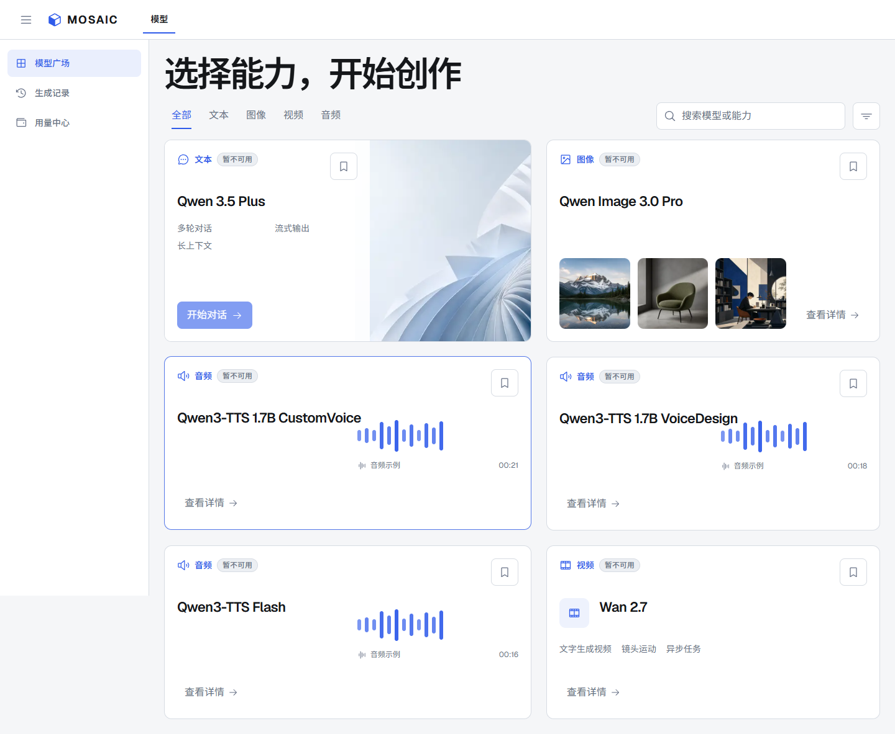

# MOSAIC

面向多租户的 AI 模型聚合平台。当前分支完成了 E0–E10 生产硬化，提供邀请制账号、
租户隔离、持久任务、原子计费、对象存储、可观测性、备份恢复和可审计发布凭据。
Provider 路由默认禁用，只有新鲜且来源绑定的真实四模态证据通过后才能激活。

当前仓库是收口交接快照，不是已完成商业能力的 production-ready 产品。已验证范围、
真实模型证据的提交边界和剩余缺口见 [HANDOFF.md](HANDOFF.md)。



## 当前实现

- 高保真 Next.js 控制台：模型广场、对话、生成工作台、生成历史、用量中心。
- 对标百炼模型体验的单画布工作台：文本、图片、视频与语音拥有各自的真实任务入口。
- FastAPI 邀请制账号、强制首次改密、Session/CSRF、权限控制与 PostgreSQL RLS。
- PostgreSQL 持久化对话、任务、事件、用量、钱包、账本与 Outbox。
- app/worker/owner 数据库角色分离，API 不能使用 superuser、表 owner 或 BYPASSRLS。
- RabbitMQ quorum queue、fenced outbox、独立媒体/视频 worker 与租约并发控制。
- Redis 登录限流、SSE 唤醒以及 relay/chat/media/video readiness 心跳。
- S3-compatible 产物转存、类型/大小/摘要校验和可恢复生命周期清理。
- 低基数指标、结构化日志、告警/看板、带 HMAC 与镜像 digest 的发布 receipt。
- PostgreSQL 逻辑备份、MinIO mirror 和迁移 head/对象数量绑定的恢复验证。
- 已接入百炼路由：`qwen3.5-plus`、`qwen-image-3.0-pro`、`wan2.7-t2v`、
  `qwen3-tts-flash`。四模态真实 smoke 证据绑定 `ba76f749…`，不作为后续提交的替代验收。
- 真实媒体产物通过租户鉴权 API 返回，不把 Provider 临时地址暴露给前端。

## 本地启动

完整步骤见
[本地真实模型运行手册](docs/runbooks/local-production-development.md)。核心进程是：

```powershell
pnpm relay:chat
pnpm relay:generation
pnpm worker:chat
pnpm worker:generation
pnpm worker:generation:video
pnpm cleanup:artifacts
pnpm dev:api
pnpm dev:web
```

## 验证

```powershell
pnpm verify:api
pnpm verify:web
pnpm test:e2e
pwsh -NoProfile -File scripts/verify-release.ps1 -StaticOnly
```

历史四模态与浏览器闭环证据见
[成功演示记录](docs/evidence/phase3-successful-demo.md)；当前交接证据见
[E10 integration receipt](docs/evidence/production-hardening-e10.md)；工作台重设证据见
[百炼对标工作台](docs/evidence/bailian-workspace-redesign.md)。

## 边界

代码和本地原生拓扑是 production release candidate，不等于已开放外部生产流量。
正式放量仍要求当前 commit 的付费 Provider live evidence、Docker 镜像启动/digest Gate、
外部 TLS/secret 配置、容量与故障演练全部通过。任一 Gate 未运行时，receipt 只能标记为
`BOUNDED`；模型保持“暂不可用”，不能用旧证据或伪数据激活。

当前只有一个真实文本路由，且商业支付、平台 API Key、System Prompt、文件上下文与联网
引用等客户能力尚未完成。公共可见不代表已选择开源许可证或授予再分发权利。
