# Bailian-aligned MOSAIC workspace redesign

Date: 2026-08-25

Branch: `codex/bailian-workspace-redesign`

## Outcome

The model-entry experience now follows the supplied Bailian playground
structure: one task-oriented canvas, contextual model header, usage notice,
central primary input and modality-specific controls. The previous permanent
desktop conversation column and generic media form card are removed.

The final pass also closes the real execution gap for tenant-bound Qwen3-TTS
VoiceDesign and CustomVoice routes. Existing auth, tenant isolation, SSE
resume, stop/regenerate, generation idempotency, durable queue execution and
artifact delivery contracts remain active.

## Text workspace

- Conversation history is available from one header button on every viewport
  and opens the existing accessible dialog.
- Empty conversations center the model heading with a Bailian-sized 120 px
  composer; active conversations use a 104 px composer.
- Active conversations use an 880 px message rail and a sticky composer.
- User turns render as right-aligned pale bubbles; model turns remain open
  document-style responses with copy and regenerate controls.
- The local header now has model experience/debug tabs, new conversation,
  fullscreen and history controls, followed by the usage notice and model row.
- Failed submission, cursor resume, draft, stop, regenerate, copy and stale
  route protections remain active.

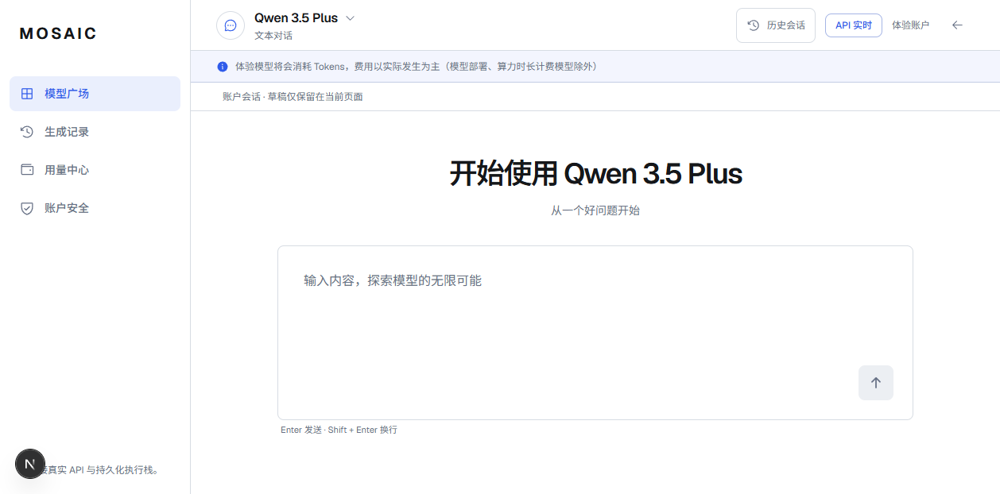

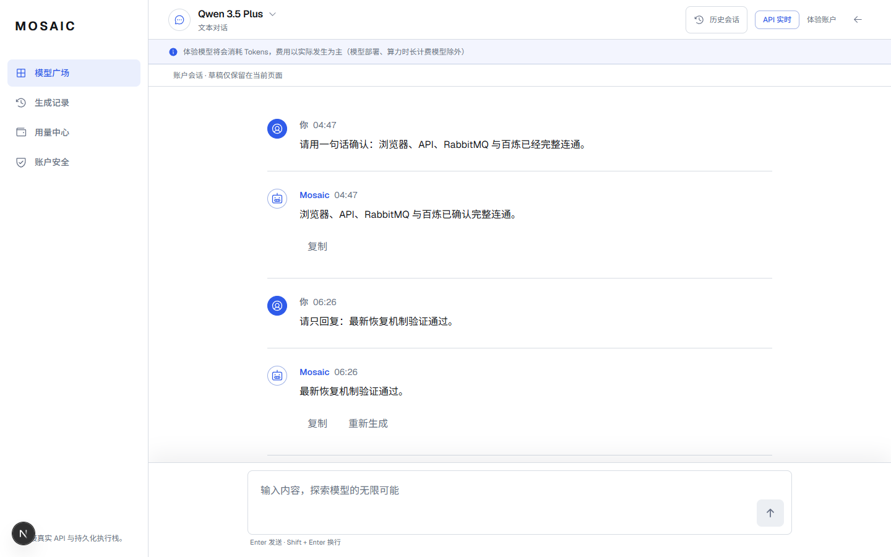

## Media workspaces

- Image: real prompt, size and count controls; reference image is disabled and
  explicitly marked as a future capability.
- Video: real prompt, resolution, ratio and duration controls; reference media
  is disabled and explicitly marked as a future capability.
- Audio: real text input with server-bound Flash, VoiceDesign and CustomVoice
  voices. Provider voice IDs never enter the browser request or public API.
- Inspiration media is labeled as reference content, never as generated output.

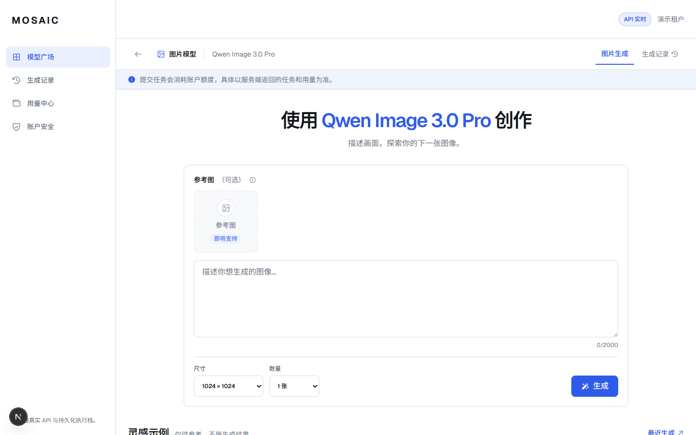

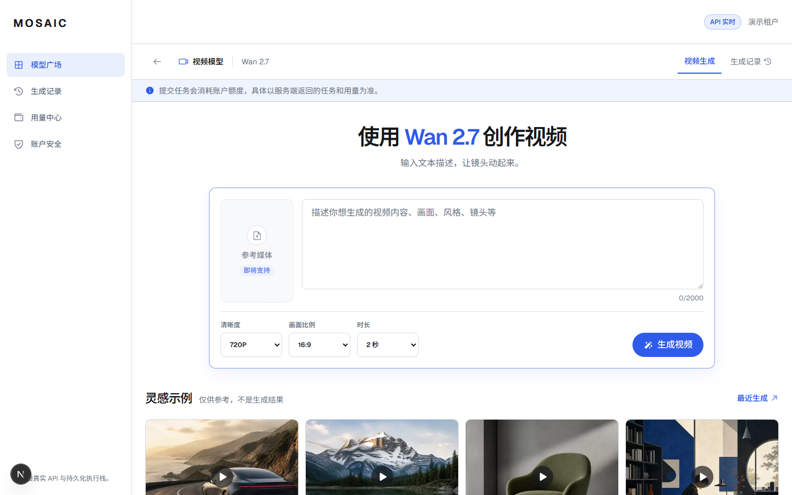

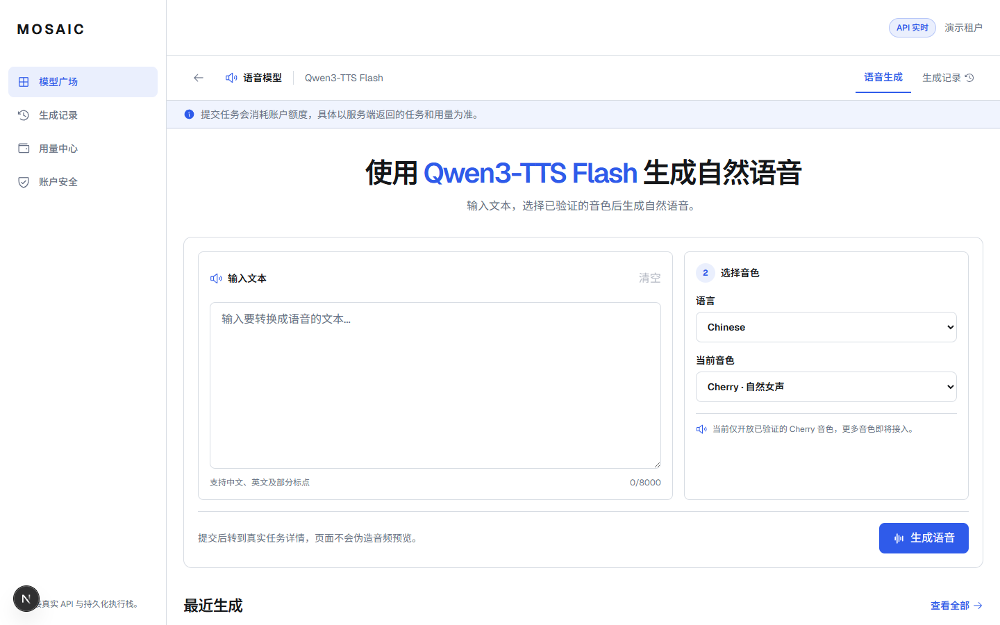

## Final shell alignment

- The global header is 64 px and contains `模型 / Agent / 文档 / API 参考`.
- `应用` was renamed to `Agent`; `订阅`, global `体验`, region and business
  workspace selectors were removed.
- `已连接真实 API 与持久化执行栈`, `API 实时`, `演示租户` and the visible
  Next.js development indicator were removed.
- API documentation URLs are same-origin rewrites rather than loopback links,
  so they remain valid for external tenants.
- The left rail no longer repeats the brand or internal execution-state copy.

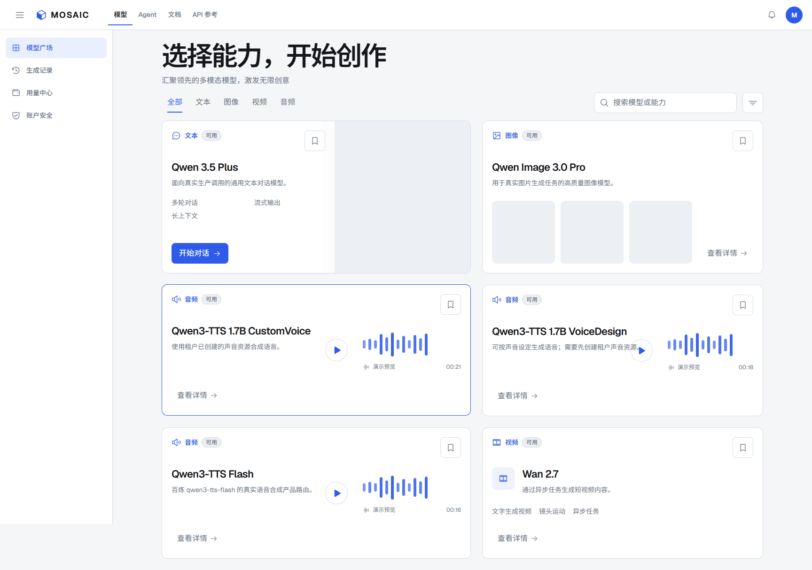

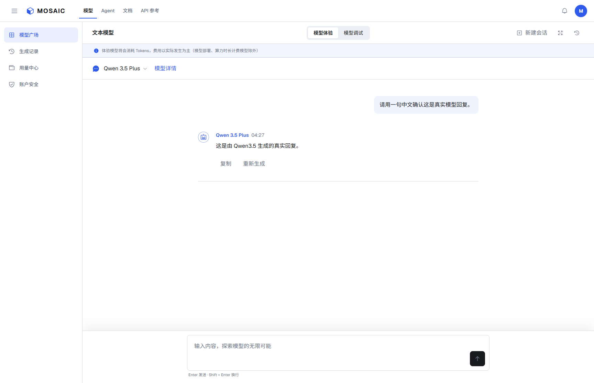

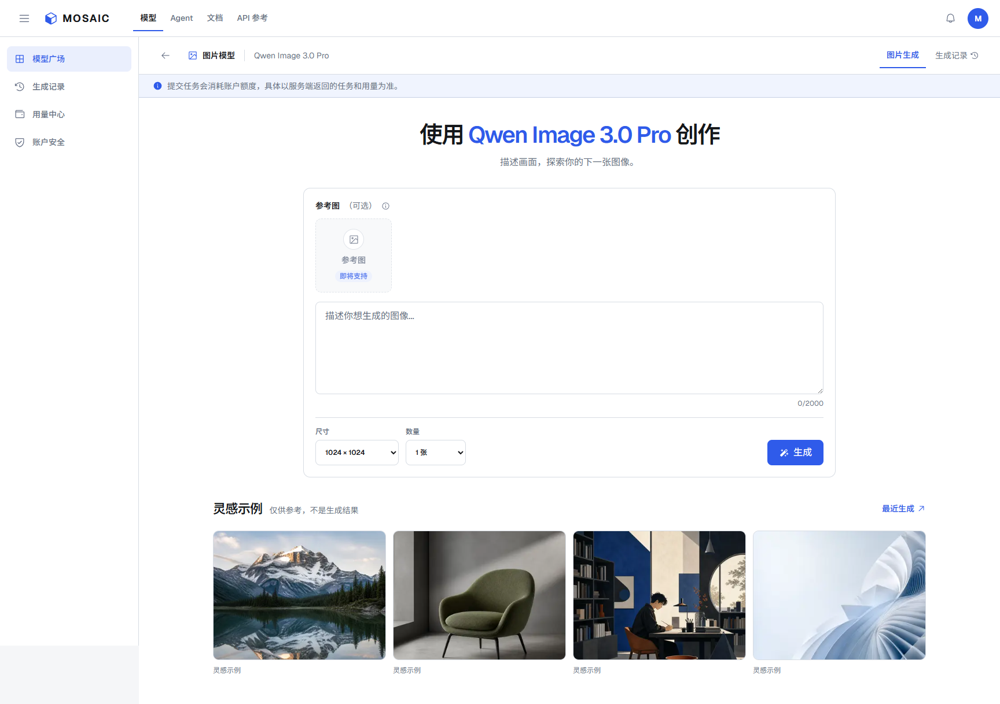

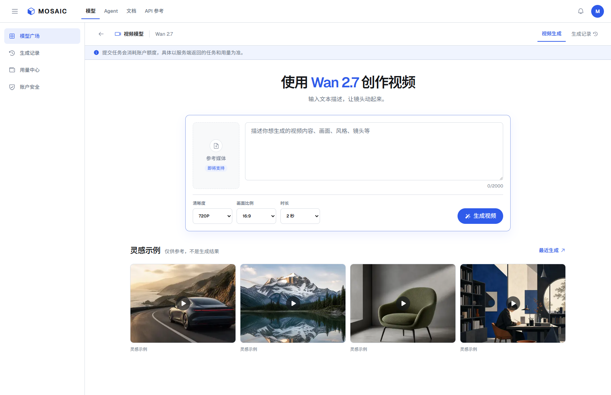

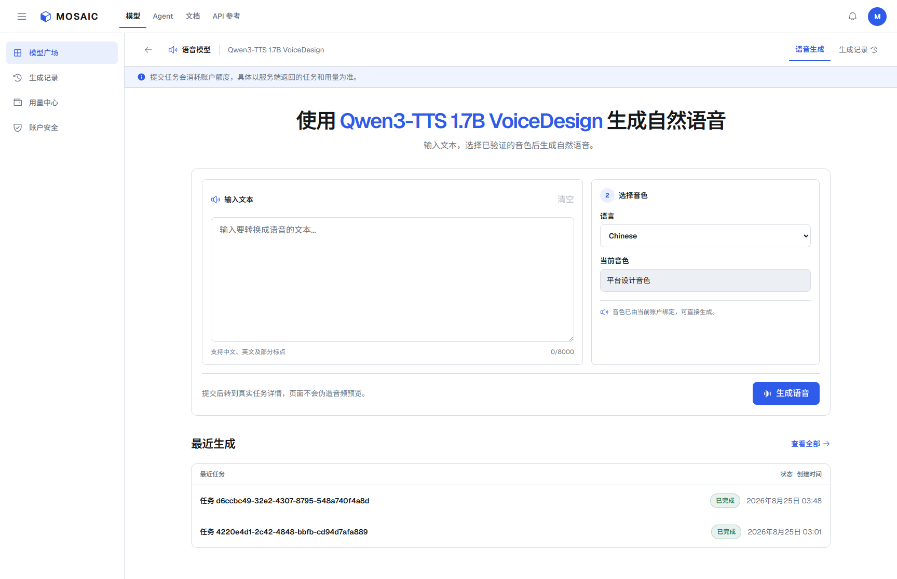

## Responsive evidence

Both task shells stack without horizontal overflow at 390 x 844. Chat keeps
its dedicated full-height workspace; media studios retain the mobile console
navigation and safe-area padding.

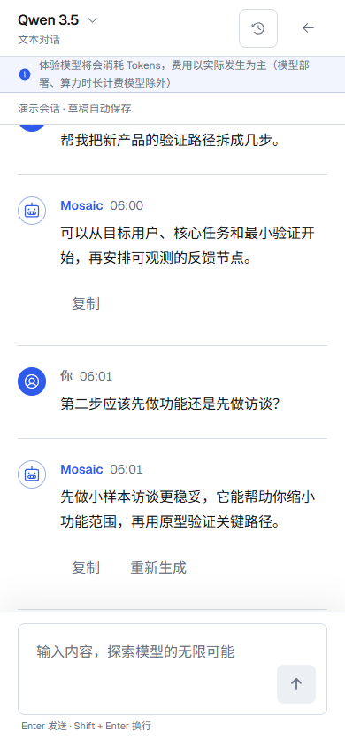

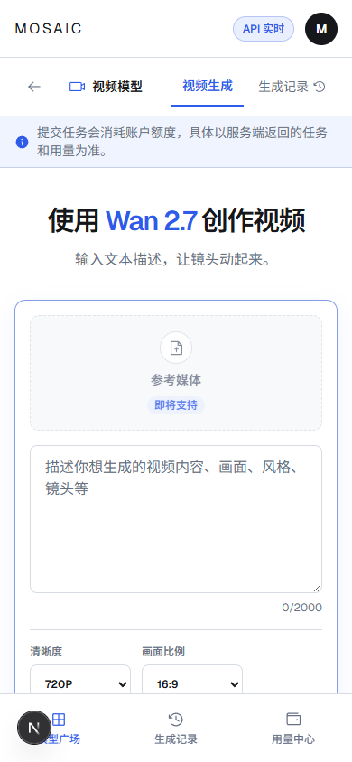

## Live verification

- The first post-redesign chat request encountered a confirmed
  `PROVIDER_CONNECTION_ERROR` while Clash was in global mode. It had no Provider
  request ID and its reservation was released.
- After restoring Clash rule mode, a new browser request completed through the
  real stack and returned: “新版工作台真实链路已连通。”
- A redesigned audio form submitted job
  `1192ed42-f9b8-4eb2-a848-5513a602b496`; it completed through the real worker
  and produced an authenticated 165.0 KB WAV artifact. Browser media metadata
  reached ready state 4 with a 3.52 second duration.
- The final full-stack gate logged in through the public auth boundary, required
  the complete visible catalog to be executable, then created new real tasks
  for six products. `Qwen 3.5 Plus`, `Qwen Image 3.0 Pro`, `Wan 2.7`,
  `Qwen3-TTS Flash`, `Qwen3-TTS 1.7B VoiceDesign` and
  `Qwen3-TTS 1.7B CustomVoice` all succeeded. Each media job returned at least
  one authenticated, non-empty artifact.
- VoiceDesign and CustomVoice were created and synthesis-verified against the
  exact Bailian targets `qwen3-tts-vd-2026-01-26` and
  `qwen3-tts-vc-2026-01-22`. Their resource IDs remain redacted in database
  entitlement configuration.
- `Qwen3-TTS 1.7B Base` is not aliased to Flash. The catalog seed and migration
  disable all historical Base routes, mark it unsupported, and omit it from
  the customer-facing catalog until a real self-hosted route exists.

## Automated verification

- Web Vitest: 263 passed across 27 files.
- Public contracts: 52 passed.
- Design tokens: 4 passed.
- API pytest: 210 passed, with 5 explicit opt-in/live condition skips.
- Ruff, strict mypy, ESLint, TypeScript, brand centralization, dependency
  boundaries, Alembic single-head validation and the Next.js production build:
  passed.
- Playwright: 108 passed across desktop, wide, 390 x 844 and 426 x 923
  projects, including updated visual snapshots, empty-workspace geometry,
  history dialog, streaming, stop, resume, regenerate and accessibility.
- Independent frontend and backend read-only reviews found no P0. Reported
  route-selection, idempotency, same-origin docs, accessibility and misleading
  control issues were addressed before the final gates.

## Visual source

The generated implementation references and the extracted design rules live in
`docs/design-references/bailian-workspace/`. They were created before coding in
accordance with the image-first workflow and preserve MOSAIC branding rather
than copying Alibaba brand assets.
