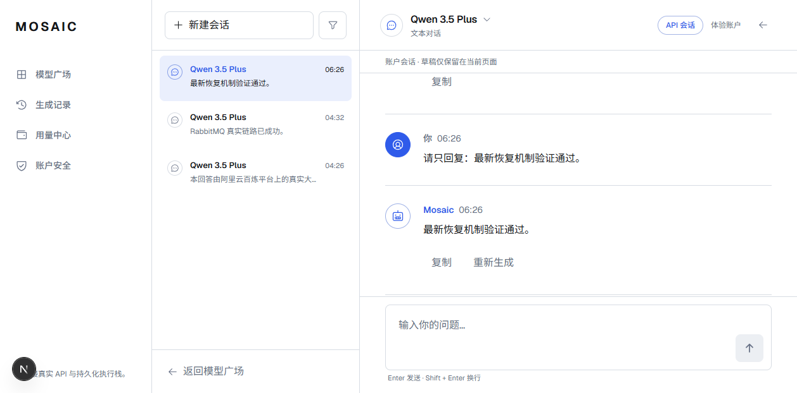
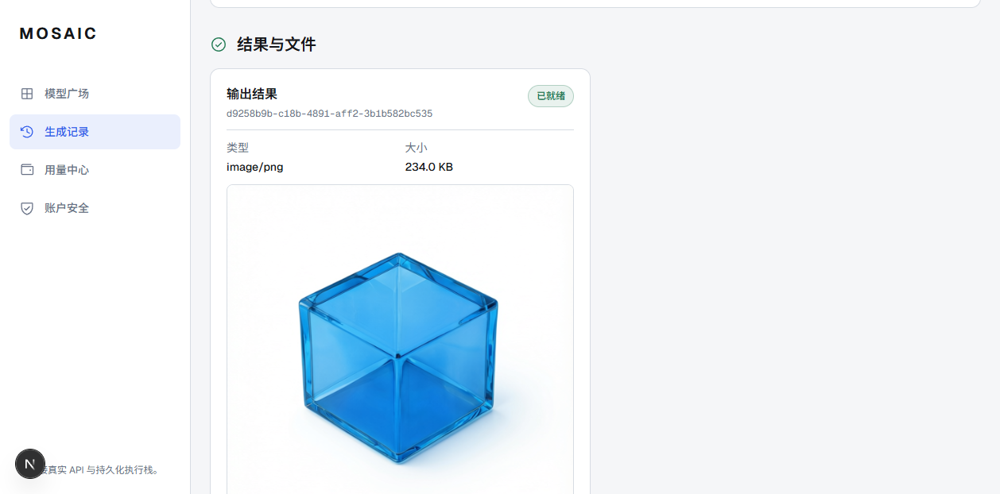
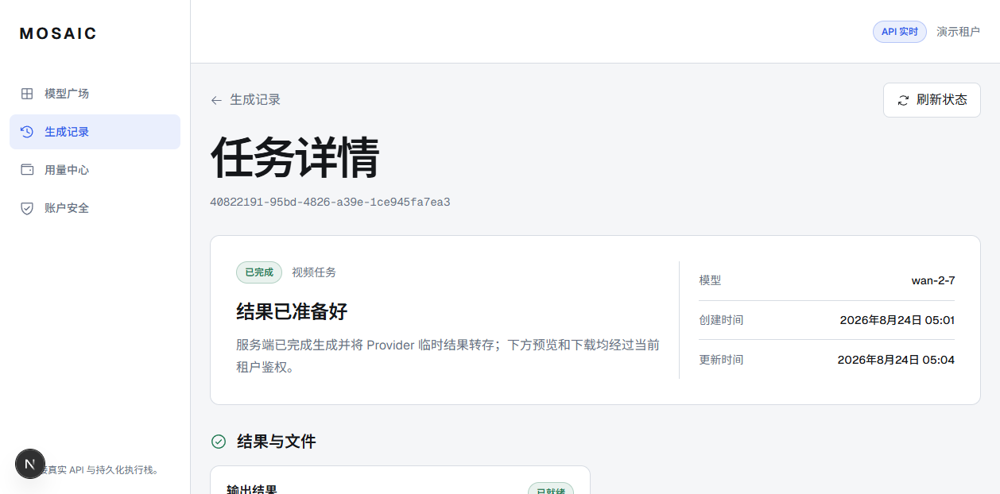
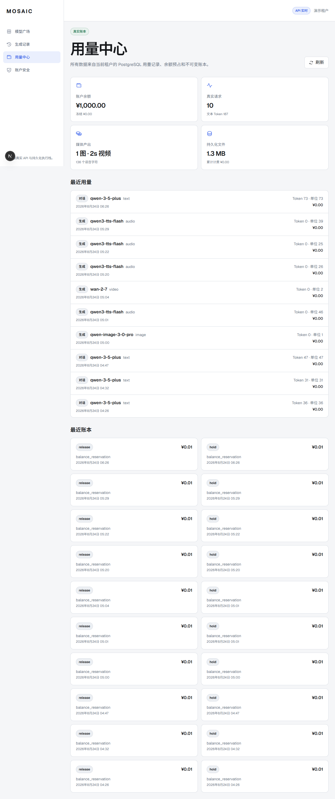

# Phase 3 successful real-model demo

Date: 2026-08-24

Branch: `codex/product-production-backend`

## Result

MOSAIC now has a locally runnable, tenant-authenticated demonstration in which
the browser calls the real API, durable work passes through PostgreSQL and
RabbitMQ, and the worker invokes real Bailian models. Text, image, video and
audio were each completed and displayed without a mock provider.

This is a successful product demo and a production-shaped vertical slice. It is
not yet an externally deployable production release; the remaining boundary is
listed below.

## Verified customer path

```text
Browser
  -> FastAPI session + tenant authorization
  -> PostgreSQL job/request + outbox transaction
  -> fenced relay
  -> RabbitMQ durable quorum queue
  -> idempotent leased worker
  -> Bailian real model
  -> durable result, usage and billing settlement
  -> authenticated artifact/history API
  -> browser result page
```

Both chat and media queues have dedicated routing keys and dead-letter queues.
Broker messages contain identifiers only; prompts and authoritative job state
remain in PostgreSQL. Provider calls happen outside the HTTP transaction.

## Real evidence

### Text chat

- Real model: `qwen3.5-plus`
- Browser-created conversation:
  `cbebe3c8-81e1-46b6-9e69-98a7de429640`
- Durable SSE replay, request usage, Provider request identity, outbox publish
  and queue consumption were verified against the live database and broker.
- Confirmed response: “浏览器、API、RabbitMQ 与百炼已确认完整连通。”



### Image

- Real model: `qwen-image-3.0-pro`
- Job: `e8b99b57-0e6a-4ba8-b95a-6785073e3339`
- Completed artifact: 239,603 bytes
- The artifact is served through the authenticated API rather than exposing the
  Provider's temporary signed URL.



### Video

- Real model: `wan2.7-t2v`
- Job: `40822191-95bd-4826-a39e-1ce945fa7ea3`
- Completed artifact: 458,024 bytes, 2.02 seconds, 1280 x 720
- The asynchronous Provider task ID is persisted for later reconciliation.



### Audio

- Real model: `qwen3-tts-flash`
- API job: `1499caa0-a490-4ee4-aa35-854a00b9f9c6`
- Browser-submitted job: `972e8a81-b5d7-4a0c-85d7-457bcb91d02f`
- Completed artifact: 226,604 bytes; browser playback metadata reached ready
  state and reported a 3.84-second generated clip for the browser run.

### Usage and wallet

- The usage page reads the authenticated tenant's PostgreSQL records.
- The captured screenshot contained 9 real requests and 114 text tokens. A
  final post-recovery revalidation added one real chat turn; the live dashboard
  then showed 10 requests, 187 text tokens and about 1.3 MB of stored media.
- The local demo tenant was credited CNY 1,000 through an idempotent immutable
  ledger entry.
- Current charging uses the explicit `demo-promo-v1` policy. It records real
  usage but does not claim to implement production tariffs.



## Runtime verification

- PostgreSQL migration upgraded the real local database to
  `20260824_0006`; the schema contains the tenant, auth, catalog, chat,
  generation, usage, wallet, ledger and fenced-outbox tables.
- Redis readiness and authentication rate-limit dependencies responded.
- RabbitMQ declared durable direct exchanges, quorum work queues and quorum
  dead-letter queues for chat and generation.
- `/api/v1/health/ready` returned HTTP 200 only while both worker heartbeat
  gates were present.
- Stopping the generation relay and waiting for its heartbeat TTL changed
  readiness to HTTP 503; restarting it restored HTTP 200. This verifies that a
  deployment/load balancer can stop routing new work when a consumer is alive
  but its relay is missing. Already accepted work remains durable in outbox.
- A four-modal Provider smoke run passed with run ID
  `0368bcf9-87cd-41a4-b99d-f985dbab2872`.
- Browser verification covered login, catalog, conversation creation, real chat
  streaming, history refresh, media history/detail, image display, audio
  playback metadata, video metadata and the usage dashboard.
- After the recovery changes, the browser submitted a fresh text turn and the
  real model returned “最新恢复机制验证通过。”; usage and the promotional
  hold/release ledger pair appeared immediately afterward.
- The final database snapshot contained 4 succeeded chat requests, 6 succeeded
  generation jobs, 10 published outbox rows and 10 committed reservations,
  with no pending/unknown demo rows.

## Automated gates

- API: 204 passed, 5 explicitly skipped. Four skips are the opt-in live
  Provider pytest gate covered separately by the accepted smoke run; one is an
  unprovisioned dedicated PostgreSQL billing-concurrency fixture and remains a
  real pre-production gap.
- Ruff: passed.
- Strict mypy: passed for 99 source files.
- Alembic: exactly one head, `20260824_0006`.
- Web: 252 passed.
- Public contracts: 52 passed.
- Design tokens: 4 passed.
- ESLint, TypeScript, brand scan, dependency-boundary scan and production build:
  passed.
- Existing Playwright visual/interaction suite: 104 passed in Demo mode. The
  real API browser path above was verified separately and is the live evidence.

## Honest boundary before external customers

- Media artifacts currently use tenant-scoped authenticated local-disk storage;
  production needs S3-compatible object storage, lifecycle rules, malware/type
  inspection and a CDN/download policy.
- Billing settlement and an immutable ledger exist, but production pricing,
  payment collection, invoices, refunds and finance reconciliation do not.
- Native tenant login exists, but email verification, password reset, MFA,
  tenant administration, audit export and support tooling still need delivery.
- `submitted_unknown` intentionally avoids unsafe automatic retry after an
  ambiguous Provider submission. Production operations need an operator queue
  and Provider-specific reconciliation policy.
- Horizontal load, chaos recovery, backup/restore, observability, alerting,
  secrets management and regional deployment have not passed acceptance.
- Redis-backed SSE fan-out, cursor pagination and retention controls remain
  necessary before high-volume external traffic.

The correct claim for this branch is: “real four-modal, browser-to-provider
product demo with durable tenant data and queue-backed workers.” It is not yet
“production ready for unrestricted external tenants.”
